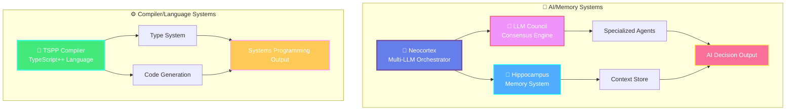

<div align="center">

# 🧠 **Hiren Rana** · `theQuarky`

*Building intelligence from silicon to semantics — where compilers meet consciousness.*

[](https://github.com/theQuarky)
[](https://twitter.com/ranahiren27)

</div>

---

## 🎯 About Me

I'm an **architect of cognitive systems** and a **compiler theorist** who believes that great software mimics the brain's elegance. My work spans the full spectrum from low-level compiler infrastructure to high-level LLM orchestration, unified by a singular vision: **building systems that think, remember, and reason**.

```
┌──────────────────────────────────────────────────────────────┐
│  "Code is thought crystallized; compilers are the bridges    │
│   between human intent and machine execution."               │
│                                           — theQuarky        │
└──────────────────────────────────────────────────────────────┘
```

---

## 🧬 Core Engineering Systems

My work spans two major pillars: **AI/Memory architectures** and **compiler/language infrastructure**:

### 🤖 Brain-Inspired AI Systems

#### 🔬 **Neocortex** · *Multi-LLM Orchestration Engine*
The executive center — a sophisticated orchestrator that coordinates multiple language models in parallel, inspired by the prefrontal cortex's role in decision-making and reasoning.

#### 🧠 **Hippocampus** · *Long-Term Memory Architecture*
A persistent, intelligent memory system that stores, indexes, and retrieves contextual information across sessions. Built to solve the forgetting problem in conversational AI.

#### 🏛️ **LLM Council** · *Collective Intelligence Framework*
An experimental system where multiple specialized AI agents deliberate, vote, and reach consensus on complex problems — mimicking human committee dynamics.

### ⚙️ Compiler & Language Tooling

#### 🔧 **TSPP-Compiler** · *TypeScript++ Language Project*
A **standalone compiler and programming language** that combines **TypeScript-like syntax** with **C++-level capabilities**. TSPP is designed to help web developers transition into systems programming, compiler design, memory models, and low-level architecture. It bridges the gap between high-level web development and systems engineering, making compiler theory and memory management accessible to JavaScript/TypeScript developers who want to understand how languages work under the hood.



---

## 🏗️ Applications & Backend Systems

### 💬 **Vibe-Match** · *Taste-Based Social Discovery*
A real-time chat platform that connects people based on aesthetic preferences, interests, and cultural resonance rather than superficial metrics.

### 🔌 **Chat-Service-Backend** · *Scalable WebSocket Infrastructure*
High-performance backend for real-time messaging, built with horizontal scalability and fault tolerance in mind.

---

## 🎨 Creative Coding & Audio Tools

Engineering meets artistry in these experimental multimedia projects:

### 🎵 **Leaf-Music** · *Interactive Audio Visualizer*
A creative exploration of generative audio-visual experiences, where music becomes a living, breathing organism.

### 🎧 **Beat-Boxx** · *Rhythm Engine*
A beat-making playground for crafting rhythms programmatically — code as composition.

### 📺 **Tube-Music** · *Streaming Audio Platform*
Experimentation with audio streaming architectures and user experience design for music discovery.

---

## ✍️ Writing & Teaching

### 📖 **How to Learn Any Programming Language**
A meta-guide on language acquisition for developers. Not a tutorial, but a framework for thinking about learning itself—covering syntax patterns, semantic models, and the cognitive process of becoming fluent in new languages.

**Core Philosophy**: *Every language is a dialect of computation; once you understand the universal grammar, learning becomes pattern recognition.*

---

## 🔬 Experiments & Curiosities

### ♟️ **Chess-Engine-in-C** · *Systems & Algorithms at Depth*
A deep dive into game theory, alpha-beta pruning, heuristic evaluation, and low-level optimization. Chess engines are the perfect sandbox for exploring computational complexity.

---

## 🎨 Architectural Philosophy

```
         ╔════════════════════════════════════════════════════════╗
         ║                                                        ║
         ║        SYSTEM DESIGN PRINCIPLES                        ║
         ║                                                        ║
         ║   🤖 AI/Memory Systems:                                ║
         ║      • Memory is not storage — it's retrieval         ║
         ║      • Intelligence is orchestration, not computation ║
         ║                                                        ║
         ║   ⚙️ Compiler/Language Systems:                        ║
         ║      • Compilation is transformation with intent      ║
         ║      • Languages should bridge paradigms              ║
         ║                                                        ║
         ║   🧠 Universal:                                        ║
         ║      • Systems should learn, not just execute         ║
         ║                                                        ║
         ╚════════════════════════════════════════════════════════╝
```

---

## 📊 GitHub Metrics

<div align="center">

[](https://github.com/ryo-ma/github-profile-trophy)

</div>

<div align="center">
  
  
</div>

<div align="center">
  
[](https://git.io/streak-stats)

</div>

---

## 🌐 Connect & Collaborate

<div align="center">

[](https://twitter.com/ranahiren27)
[](https://instagram.com/ghost_particle_)
[](mailto:ranahiren27@gmail.com)

**Open to collaborations on**: Compiler Design · Memory Systems · LLM Orchestration · Cognitive Architectures

</div>

---

<div align="center">

### 🧠 *"The brain doesn't compile — it interprets, adapts, and evolves. Let's build software that does the same."*

</div>
